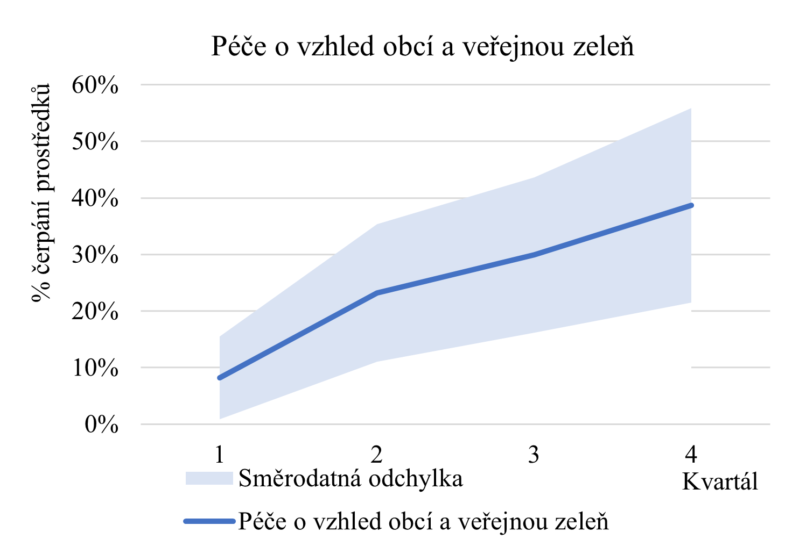
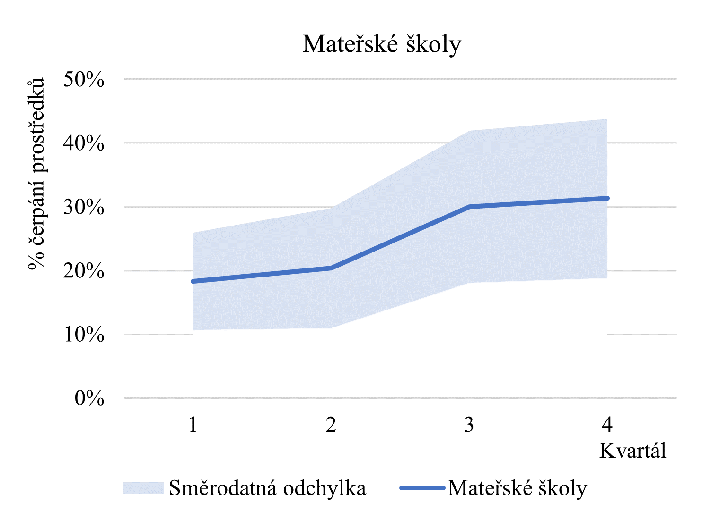

# Úvod

Předmětem této analýzy je rozpočtové hospodaření obcí s rozšířenou působností (bez statutárních měst a hlavního města Prahy) v roce 2019. Analýza má tři dílčí části.

Zaprvé se analýza zabývá průběhem čerpání finančních prostředků jednotlivých paragrafů.
Poznatky této části identifikují, zdali existuje set paragrafů, u kterých platí, že jsou čerpány zpravidla počátkem roku versus paragrafy, u kterých dochází k čerpání jejich finančních prostředků obyčejně koncem účetního roku.

Druhým bodem jsou přesuny finančních prostředků, ke kterým dochází na úrovni paragrafů v průběhu roku. Cílem této části je identifikovat, u jakých paragrafů dochází k nedostatečnému finančnímu plánování, a tudíž dochází ke změnám a přesunům v rámci obecního rozpočtu.

Třetí dílčí část se věnuje korelacím, vztahu čerpání finančních prostředků jednotlivých paragrafů. Korelace mají za cíl identifikovat, zdali je možné pozorovat určité trendy v přesunech finančních prostředků v rámci rozpočtu, tj. odkud se v průběhu roku peníze berou, a na co zpravidla
putují. Volně tak navazuje na předchozí části, které determinují průběh čerpání a přesuny prostředků, k nimž dochází.

## Průběh čerpání finančních prostředků

Zajímavým zjištěním analýzy je, že obecně lze nalézt paragrafy rozpočtu, jejichž čerpání se s blížícím koncem roku zvyšuje, zatímco směrodatná odchylka zůstavá relativně malá[^1]. Ovšem z analýzy nevyplývají paragrafy, jejichž čerpání by mělo opačnou tendenci, tedy s průběhem roku by čerpání vykazovalo klesající trend, zatímco směrodatná odchylka by zůstavala relativně malá. To může být dáno tendencí obcí zpočátku roku zpravidla šetřit peníze na nečekané výdaje v průběhu roku.

Rostoucí trend čerpání finančních prostředků lze pozorovat u paragrafů Mateřské školy (3111), Základní školy (3113), Sběr a svoz komunálních odpadů (3722), Využívání a zneškodňování komunálních odpadů (3725), Péče o vzhled obcí a veřejnou zeleň (3745), Bezpečnost a veřejený pořádek (5351), Zastupitelstva obcí (6112), Činnost místní správy (6171) a Převody vlastním fondům v rozpočtech územní úrovně (6330). U těchto paragrafů lze tedy říct, že se za ně utrácí hlavně v druhé polovině roku.

Pro tento článek byly vybrány paragrafy Mateřské školy a Péče o vzhled obcí a veřejnou zeleň, jelikož jsou z hlediska obecního hospodaření s rozpočtem zajímavé a rostoucí trend je zde velmi patrný. Grafické zpracování zbývajících paragrafů s roustoucím trendem čerpání si lze prohlédnout v příloze. U obou paragrafů si můžeme všimnout, že směrodatná odchylky je začátkem roku menší, což naznačuje, že většina obcí v prvních měsících neutrácí příliš mnoho prostředku za péči o vzhled obce a zeleň, ani neposílá prostředky do mateřských škol. V průběhu roku se ovšem směrodatná odchylka rozšiřuje, z čehož plyne, že čerpání rozpočtu na tyto paragrafy se stává dynamičtější a samotná výše čerpání je různorodá. Odchylky stále zůstávají relativně malé (do 15 procentních bodů od průměru), tudíž se dá mluvit o rostoucím trendu v čerpání finančních prostředků těchto paragrafů na úrovní obcí s rozšířenou působností.

[^1]: Pro účely analýzy byla směrodatná odchylka definována jako menší než 15 procentních bodů.

## Přesuny finančních prostředků

Druhá část analýzy se zaměřuje na paragrafy, u nichž často dochází k velkým přesunům v rozpočtu. Konkrétně jsou přesuny charakterizovány jako největší změny v rozpočtu po změnách mezi druhým a čtvrtým kvartálem roku 2019 určitého paragrafu. Velké přesuny se dají považovat za indikátor nedostatečného finančního plánování.

K největším kladným změnám dochází u paragrafů, jež pokrývají výdaje na školství (mateřské a základní školy), bytové i nebytové hospodářství, vlastní správní činnost obcí, komunální služby, dále se během roku 2019 nejvíce navýšil rozpočet na domovy pro seniory či zachování a obnovu kulturních památek.

Co se týče paragrafů, jejichž rozpočty se naproti tomu během roku 2019 nejvýrazněji snížily, jedná se o odvádění a čištění odpadních vod a nakládání s kaly, čištění spodní vody a dekontaminaci půdy. Finanční prostředky byly přesunuty také z rozpočtu dopravy (paragrafy Provoz veřejné silniční dopravy, Ostatní záležitosti pozemních komunikací). Dále se rozpočet během roku významně snížil na výdaje spojené s územním rozvojem a plánováním, službami v sociální oblasti a politiky nezaměstnanosti, knihovnickými činnostmi a pohřebnictvím.

### Navýšené

| Pořadí | ID   | Paragraf                                           | Rozpočet po změnách 2.kv. | Celková změna | Průměrná změna |   Odchylka | Četnost |
|--------|------|----------------------------------------------------|--------------------------:|--------------:|---------------:|-----------:|--------:|
| 1      | 6330 | Převody vlastním fondům v rozpočtech územní úrovně |             3 685 616 776 | 1 268 569 307 |      7 086 979 | 54 346 161 |     179 |
| 2      | 3113 | Základní školy                                     |             6 576 148 599 |   629 652 812 |      3 537 375 |  9 603 340 |     178 |
| 3      | 6171 | Činnost místní správy                              |            15 749 596 209 |   193 636 099 |      1 081 766 |  5 035 195 |     179 |
| 4      | 3612 | Bytové hospodářství                                |             5 550 258 994 |   160 809 896 |        934 941 |  6 667 616 |     172 |
| 5      | 3111 | Mateřské školy                                     |             1 600 426 061 |   154 324 522 |        886 923 |  1 374 797 |     174 |
| 6      | 3639 | Komunální služby a územní rozvoj jinde nezařazené  |             6 060 273 320 |   139 262 737 |        778 004 | 12 166 527 |     179 |
| 7      | 4350 | Domovy pro seniory                                 |               740 643 878 |   118 859 516 |      1 650 827 |  4 149 404 |      72 |
| 8      | 6399 | Ostatní finanční operace                           |             1 952 765 241 |    96 333 827 |        553 643 |  8 584 990 |     174 |
| 9      | 3322 | Zachování a obnova kulturních památek              |               937 049 245 |    89 454 669 |        643 559 |  3 953 707 |     139 |
| 10     | 3613 | Nebytové hospodářství                              |             2 290 272 898 |    61 400 473 |        369 882 |  5 158 192 |     166 |
{:.table .table-responsive .table-sm .table-striped .text-nowrap}

### Snížené

| Pořadí | ID   | Paragraf                                                     | Rozpočet po změnách 2.kv. | Celková změna | Průměrná změna |   Odchylka | Četnost |
|--------|------|--------------------------------------------------------------|--------------------------:|--------------:|---------------:|-----------:|--------:|
| 1      | 2321 | Odvádění a čištění odpadních vod a nakládání s kaly          |             2 172 194 622 |  -134 407 271 |       -809 682 |  7 091 020 |     166 |
| 2      | 2219 | Ostatní záležitosti pozemních komunikací                     |             3 820 477 944 |   -74 445 875 |       -422 988 |  6 057 447 |     176 |
| 3      | 3636 | Územní rozvoj                                                |               190 659 664 |   -49 328 149 |       -616 602 |  5 051 432 |      80 |
| 4      | 4379 | Ostatní služby a činnosti v oblasti sociální prevence        |               127 328 895 |   -48 429 817 |       -470 192 |  5 077 262 |     103 |
| 5      | 3314 | Činnosti knihovnické                                         |             1 087 098 702 |   -43 270 399 |       -294 356 |  4 955 085 |     147 |
| 6      | 3732 | Dekontaminace půd a čištění spodní vody                      |               115 112 860 |   -33 409 940 |     -4 176 243 | 11 965 092 |       8 |
| 7      | 3632 | Pohřebnictví                                                 |               469 328 212 |   -19 536 317 |       -112 927 |  1 546 512 |     173 |
| 8      | 4399 | Ostatní záležitosti sociálních věcí a politiky zaměstnanosti |               224 077 244 |   -13 978 694 |       -103 546 |  1 092 090 |     135 |
| 9      | 2221 | Provoz veřejné silniční dopravy                              |               381 845 634 |   -13 648 762 |       -107 471 |  1 607 350 |     127 |
| 10     | 3635 | Územní plánování                                             |               230 814 744 |   -12 654 042 |        -75 322 |  1 053 431 |     168 |
{:.table .table-responsive .table-sm .table-striped .text-nowrap}

## Korelace

Závěrečná část analýzy odpovídá na otázku, k jakým významným změnám v rozpočtu v průběhu roku dochází. Intuitivně bychom se mohli ptát, kam tyto peníze putují (v případě záporné změny), nebo z jakého paragrafu byli přesunuty (v případě změny kladné). Cílem třetí části analýzy je podívat se, zdali spolu rozpočty po změnách jednotlivých paragrafů korelují a s jistým zjednodušením by se tedy dalo říct, že prostředky z paragrafu A plynou zpravidla na paragraf B (obdobně rostoucí prostředky na paragraf X se během roku přesunuly zpravidla z paragrafu Y).

K této korelační analýze bylo využity rozpočty paragrafů každé z obcí s rozšířenou působností (mimo statutárních měst a hlavního města Prahy) na kvartální bázi.

Kromě významné negativní korelace, jež byla pro účely této analýzy definována jako menší než -0.5, jsme požadovali také vysokou četnost, tedy aby se jednalo se o paragrafy, jež se vyskytují v rozpočtu alespoň 40 obcí s rozšířenou působností a dá se tedy hovořit o trendu pozorovatelném mezi významným zlomkem obcí. Dále jsme eliminovali korelace rozpočtu paragrafů, jež dosahovaly výrazné směrodatné odchylky, tedy průměrně se jednalo o negativní korelaci rozpočtu paragrafů, ovšem rozptyl hodnot kolem průměru byl výrazný.

Jedinou dvojicí paragrafů, jejichž rozpočty významně negativně korelovaly, jsou Volby do Evropského parlamentu (6117) a Ostatní všeobecná vnitřní správa jinde nezařazená (6149), jež dosahují korelace -0.99 se směrodatnou odchylkou 0.06. Tyto paragrafy mělo v loňském roce zaúčtováno alespoň 88 obcí, tedy zhruba polovina všech obcí ve vzorku.